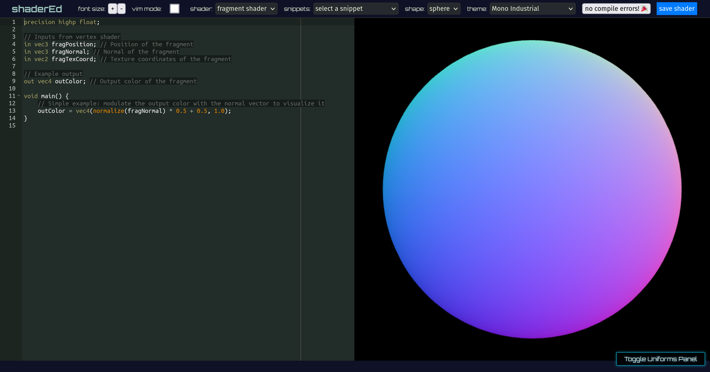

# ShaderEd - WebGL Shader Editor

Welcome to the ShaderEd repository! ShaderEd is an interactive WebGL Shader Editor designed to facilitate the development and testing of shaders in real-time. Emphasizing ease of use and accessibility, ShaderEd supports the advanced GLSL3 shading language, allowing both beginners and seasoned graphics programmers to experiment with shader programming on the web.



## Features

- **GLSL3 Support:** ShaderEd fully embraces GLSL3, providing a rich feature set for creating sophisticated shaders.
- **Live Shader Preview:** See the results of your shader code changes immediately with a dynamic 3D preview.
- **Advanced Error Handling:** Catch and correct shader compilation errors quickly with an integrated error display system.
- **Custom Uniforms:** Add, modify, and experiment with custom uniforms easily through a user-friendly UI.
- **Responsive Design:** Enjoy a seamless coding experience across different devices thanks to a responsive and intuitive interface.
- **Code Snippets:** Jumpstart your shader creation with handy snippets and templates.
- **Theme Customization:** Choose between light and dark themes to create your perfect coding environment.
- **Vim Mode Support:** For Vim enthusiasts, Vim mode is available to speed up your coding workflow.

## Getting Started

### Prerequisites

- Ensure you have a modern web browser that supports WebGL (Chrome, Firefox, Safari, etc.).
- Familiarity with HTML, CSS, and JavaScript is recommended.

### Installation

1. Clone the ShaderEd repository:

```bash
git clone https://github.com/shellfu/shadered.git
```

2. Open the project directory:

```bash
cd shadered
```

## How to Use

- **Shader Editing:** Choose between vertex and fragment shaders in the editor and begin crafting your shader code.
- **Uniform Management:** Utilize the Uniforms Panel for adding or updating uniforms in your shader code.
- **3D Preview Interaction:** Manipulate the preview with orbit controls to examine your shader from different angles.
- **Download Your Shader:** Use the "save shader" button to download and save your work locally.

## Contributing

Your contributions are welcome! If you're looking to add new features, improve existing ones, or fix bugs, please follow these steps:

1. Fork the repository.
2. Create a feature branch (`git checkout -b feature/YourFeature`).
3. Commit your changes (`git commit -am 'Add some YourFeature'`).
4. Push to the branch (`git push origin feature/YourFeature`).
5. Submit a pull request.

## License

ShaderEd is made available under the MIT License. For more information, see the LICENSE file in the repository.
